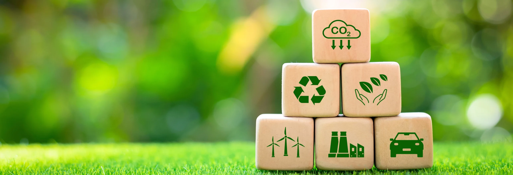

# ODS

# ODS 10: Reducción de la desigualdad

El Objetivo de Desarrollo Sostenible 10 busca la reducción de las leyes que suponen desigualdades y la diferencia de ingresos entre países.

## Retos ambientales y sociales que afectan al ODS 10

- **Brecha digital:** Millones de personas carecen de acceso a internet, dispositivos o habilidades digitales, lo que limita su participación en la economía y sociedad.
- **Impacto desigual del cambio climático:** Las comunidades vulnerables sufren más los efectos del clima extremo, sin recursos para adaptarse o recuperarse.
- **Discriminación estructural:** Grupos como migrantes, personas con discapacidad o minorías étnicas enfrentan barreras en educación, empleo y servicios públicos.

## Influencia de la tecnología

- **Positiva:** Facilita el acceso a educación, salud, empleo y participación política a través de plataformas digitales.
- **Negativa:** Si no se diseña con inclusión, puede perpetuar sesgos (por ejemplo, algoritmos discriminatorios) o excluir a quienes no tienen acceso.

## Soluciones tecnológicas

- **Infraestructura digital inclusiva:** Expansión de redes de internet en zonas rurales y desfavorecidas.
- **Software accesible:** Interfaces adaptadas para personas con discapacidad, traducción automática, lectura de pantalla.
- **Educación digital:** Programas de alfabetización tecnológica y formación en habilidades digitales.
- **IA ética:** Desarrollo de algoritmos transparentes y sin sesgos que promuevan la equidad.

## Ejemplos reales

- **Microsoft Airband:** Proyecto para llevar internet de banda ancha a comunidades rurales y marginadas.
- **Code.org:** Iniciativa global que promueve la enseñanza de programación en escuelas, especialmente en comunidades vulnerables.
- **Wheelmap.org:** Plataforma colaborativa que mapea lugares accesibles para personas con movilidad reducida.

## Indicadores para medir el progreso

- **Indicador:** Tasas de crecimiento per cápita de ingresos del 40% más pobre de la población.
- **Indicador:** Proporción de personas que viven por debajo del 50% de la mediana de ingresos, desglosada por sexo, edad y discapacidad.
- **Indicador:** Proporción de personas que perciben haber sido discriminadas por motivos prohibidos.
- **Indicador:** Número de países con políticas migratorias bien gestionadas.

## Otros ODS relacionados

- [ODS 17](https://joseasb.github.io/saspfase1_ampliar_web/ODS%2017%20Alianzas%20para%20lograr%20objetivos/): Cooperación entre gobiernos, sectores privados...
- [ODS 8](https://amancab828.github.io/SASP_04/#ods8__): Trabajo digno y crecimiento económico
- [ODS 3](https://jcanleo649.github.io/SASP_04/ods3/): Salud y bienestar