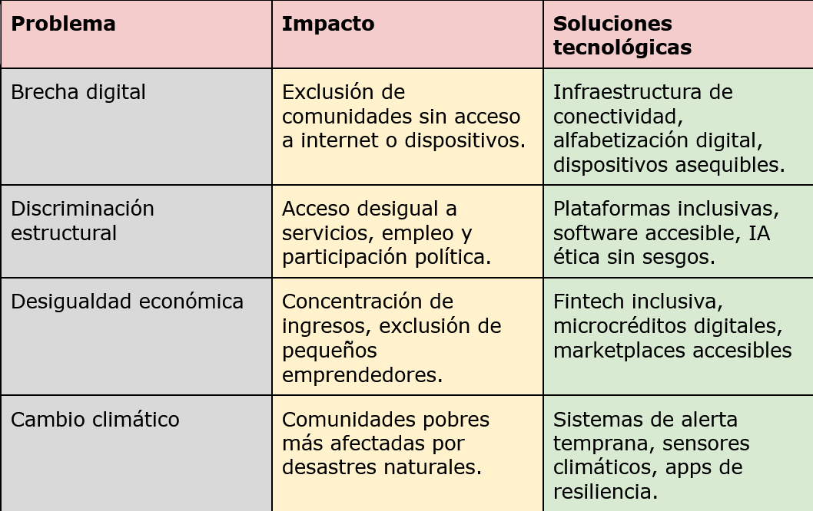

# SOSTENIBILIDAD

La sostenibilidad es la capacidad de satisfacer las necesidades de la actualidad, sin afectar a los que vengan luego. En la tecnología, se refleja en innovar para reducir el impacto de los sistemas que utilizamos cada día y en la mejor utilización de la energía con la que se alimentan.

En cuanto a lo ambiental, con la utilización de energías renovables y con una creación de componentes responsable. Económicamente, busca ser sostenible a través de una economía circular. Y por último, en el apartado social, la sostenibilidad se puede ver en la educación, a la que se hace cada vez más accesible gracias a los sistemas tecnológicos y en nuestros derechos, dándonos una mayor capacidad de investigación y solución ante la vulneración de los mismos.

---

## Aspectos ASG

Son criterios **Ambientales, Sociales y de Gobernanza**, que una empresa debe seguir para considerarse sostenible.

Estos deben interesar a las empresas de cara a inspecciones que vigilen que están cumpliendo las regulaciones establecidas, de cara al público para tener una buena relación cliente-empresa y de cara a inversores, que vean con buenos ojos las medidas de sostenibilidad aplicadas.

---

## ¿Quiénes impulsan los ODS y la Agenda 2030?

Todos los países que forman parte de la **ONU** promueven los objetivos que se declaran en los **ODS (Objetivos de Desarrollo Sostenible)** de la **Agenda 2030**.

